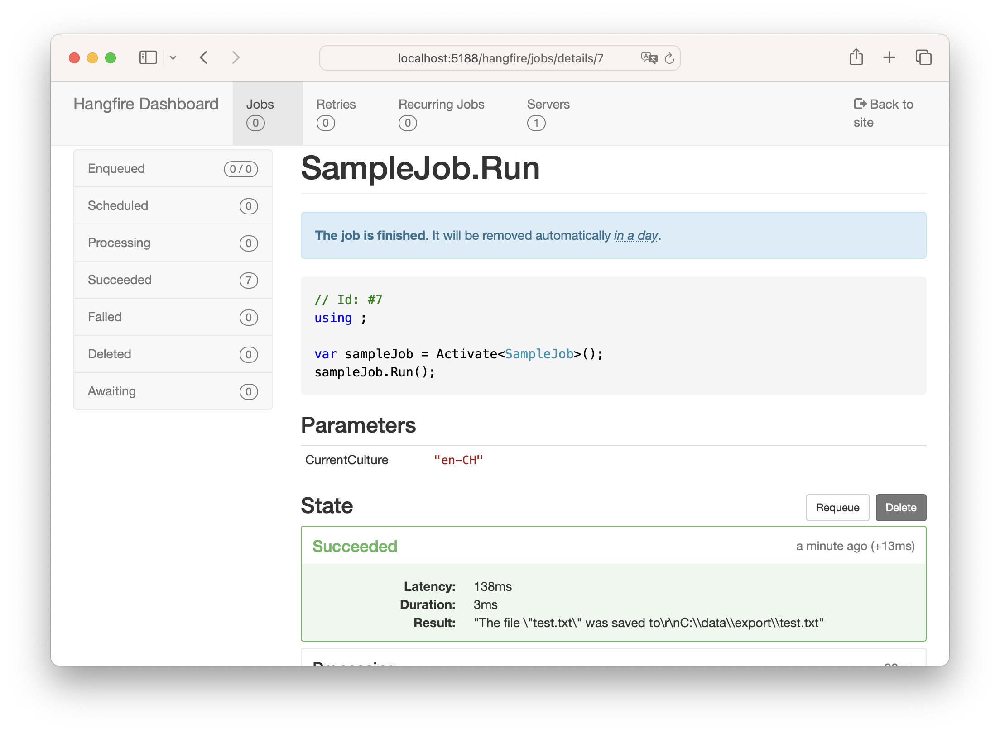
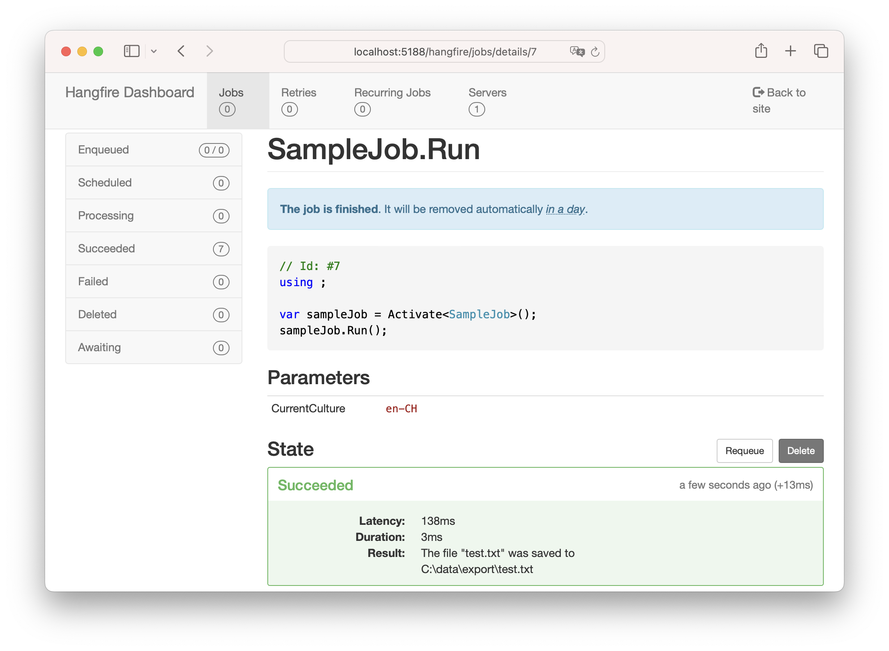

Hangfire plugin to improve the display of the *parameters* and the *result* of jobs.

Because the [Improve display of job result and properties](https://github.com/HangfireIO/Hangfire/pull/1509) pull request was not merged.

> [!NOTE]  
> No NuGet package is published yet.

## Screenshots

Without Hangfire.TidyDashboard:

* Unnecessary double quotes everywhere
* Way too many \ escaping characters

With Hangfire.TidyDashboard:

* No more double quotes
* No more \ escaping characters
* Proper new line

